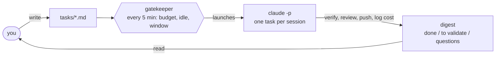

# claudemaxxing

**Your Claude Max quota expires every week whether you use it or not.**

**claudemaxxing spends the leftover on your own backlog while you sleep.**

You write task specs in Markdown.
Headless Claude Code sessions work them at night, inside a budget that never touches your daytime quota.
In the morning you read a digest and review pull requests.

```markdown
# Digest 2026-09-29

## To validate
- webapp PR #133 (template-from-catalog images): ready, merge and release.
- webapp PR #131 (lint rule banning raw fetch() to the API): ready, review/merge.
- claudemaxxing PR #27 (CI gate): green, merge.

## Questions
- webapp-just-dev-lan: accept the LAN image-upload limitation, or grow the task to fix it first?

## Done
- webapp-gardener (nightly duty): reviewed, opened #131, filed two follow-ups.
```

*Example: a morning digest, trimmed.*\
*Each line is a decision the owner takes in a minute, not a log to read.*

- **Nights are budget-safe.**
  The engine reads your real consumption from Claude Code's own transcripts and keeps a heavy day's worth in reserve for every day left before the reset.
  Set `workdays` (and `offday_reserve_ratio`, default 0.25) in the config so days off hold only a share of that reserve.
  Sessions only get the surplus.
- **Mornings are yours.**
  No session opens a quota window that would run past the morning guard (plus a short tolerance), and your own recent activity on the account blocks night launches.
  The one exception is the burn-down before the weekly reset, when the surplus would expire anyway.
- **Every task ends where it says.**
  `delivery: pr | branch | local` is a contract: only a `pr` session may push or call a mutating `gh`, and the harness denies both to the others.
- **One kill switch.**
  `touch orchestrator/PAUSED` in the backlog stops every launch.
  Delete it to resume.
- **Runs when you say so, too.**
  `manual.sh --for 3h` burns quota at any hour, with the pacing rules off and the safety rules on.

Community project, not affiliated with Anthropic.
Runs entirely on your Mac: launchd, dependency-free Python, and the Claude Code CLI.

## Quick start

Requirements: macOS, Python 3.14+ (Homebrew `python@3.14`; the macOS system `/usr/bin/python3` is too old); the shell entry points and the launchd jobs put `/opt/homebrew/bin` first on PATH, and `ORCH_PATH` overrides that PATH for an interpreter elsewhere, the [Claude Code CLI](https://code.claude.com/docs/en/overview) logged into a Pro or Max account.
Nothing to install on the Python side.

Rehearse a whole night first, in a throwaway backlog with a stubbed `claude` and zero tokens:

```bash
git clone https://github.com/OscarMasse/claudemaxxing.git && cd claudemaxxing
orchestrator/e2e-sandbox.sh
```

Then point the engine at a backlog of your own.
The backlog is a plain directory: `tasks/*.md`, `config.toml`, and the digests and state the engine writes there.
The config is plain TOML, read by the standard-library `tomllib`: shared top-level keys, then one `[[accounts]]` and one `[[projects]]` table per entry; the example's header documents every key.
An older `config.yaml` is migrated once with `python3 scripts/config_yaml_to_toml.py "$BACKLOG_ROOT"`.

```bash
export BACKLOG_ROOT=~/backlog
mkdir -p "$BACKLOG_ROOT/tasks"
cp orchestrator/config.toml "$BACKLOG_ROOT/config.toml"          # edit: claude_bin, accounts (profile dir, reset day), projects
cp examples/tasks/research-static-site-generators.md "$BACKLOG_ROOT/tasks/"
python3 orchestrator/lib/ratelimits.py seed personal 850 58 114 2026-09-24T23:10:00+02:00   # weekly cap, 5h cap, heavy-day usage, all USD
orchestrator/manual.sh --tasks research-static-site-generators --dry-run
```

The seed gives the budget its first caps: your weekly and 5-hour limits and a heavy day's usage, in USD at API list price.
Any plausible figures do to start; the status line hook described in the full setup replaces them with measured ones once enough of the week has been used to read the ratio.
The account name must match an `accounts` entry of your config.
The dry run prints the plan and launches nothing.
To see what the next night would run if it started now, use `orchestrator/gate.py preview`: per account, the ordered sessions (wave, task, model, class, estimated USD, running total) and the reason it stops.
It is budget-ordered rather than a timeline, assumes each task runs once, and writes nothing.
When it looks right, register the nightly loop and the 07:37 digest job:

```bash
orchestrator/install.sh
```

The installer prints the one manual `pmset` step that wakes the Mac before the night starts.
Full setup, including the status line hook that keeps the quota caps calibrated, is in [docs/design.md](docs/design.md#install).

## How it works



1. **Capture.**
   A task is one Markdown file with frontmatter: project, priority, `delivery`, a `verification` method, a token budget, and the `model:` (sonnet, opus, fable; default sonnet) and `effort:` (low, medium, high, xhigh, max; default medium) its session runs on.
2. **Spec.**
   You set a task `ready` once its definition of done is checkable.
   Spec quality is the bottleneck, not execution.
3. **Night.**
   Each tick, the gatekeeper measures what the week has consumed, computes tonight's share of the surplus, and launches as many fifty-minute sessions as it pays for.
   A session works one task in its own git worktree, runs the task's verification, then a fresh-context subagent tries to refute the work.
4. **Digest.**
   Every session journals into the day's digest as it exits.
   The morning job sorts it into done, to validate, and questions for you.
   A question is listed only once it is askable: a `blocked` task waits on you, a task with an unmet prerequisite is `waiting` on another task, whatever its status (see [ADR 0074](docs/adr/0074-tell-waiting-on-a-task-from-blocked-on-the-owner.md)).

Two ideas carry the design.
Background work shares a quota with a human who must never notice it, so everything is paced from measured usage, not from a schedule.
And selection is done in pure Python before any model is launched, so a night wastes no tokens deciding what to do.

The reasoning behind each rule, the scheduling classes, the budget controller, and the FAQ live in [docs/design.md](docs/design.md).
This is the [Ralph Wiggum loop](https://ghuntley.com/ralph/) with a budget and a verifier, addressing the completion-without-testing failure mode described in Anthropic's [Effective harnesses for long-running agents](https://www.anthropic.com/engineering/effective-harnesses-for-long-running-agents).

## The cost ledger

Every session appends one JSON row to `state/<account>/costs.jsonl` (older rows also sit in `state/costs.jsonl`): task, model, effort, cost in USD, duration.
An orchestrate session's row also carries `outcome`, the task's `status:` read right after the session (`done`, `blocked`, `ready`, `in-progress`), so cost per delivered task can be computed; older rows lack it.
Two fields say which version of the engine produced the row.
`engine` is the short git SHA of the claudemaxxing working tree at launch, with `-dirty` when it had uncommitted changes.
`prompt_sha` is a short hash of the exact rendered prompt the session received.
Rows written before these fields existed read as `unknown`.

`python3 orchestrator/lib/ledger.py compare <state_root> <engine-a> <engine-b>` prints, per task and overall, the run count, median USD and median duration of each engine, and says so when either side has fewer than 3 runs.
It is a descriptive read of real runs, not a controlled experiment: tasks differ, the model is nondeterministic and the codebase moves.
The morning digest names the engine the night ran on and flags a night that straddled two versions.

## Safety and limits

- **The burn-down runs open bar.**
  Unspent quota is lost at the weekly reset, so the last hours before it (`prereset_burn_hours`, 8 by default, anchored to the reset time, day or night) ignore the budget, the morning guard and the activity lock.
  Only the slot ceilings, the per-session cost cap, the kill switch and the account's own limit stop it.
- **macOS only, for now.**
  Scheduling goes through launchd and `pmset`.
  The OS seam is five scripts, documented in [orchestrator/platform/README.md](orchestrator/platform/README.md); a Linux port would swap in systemd timers.
- **A closed lid sleeps.**
  Clamshell sleep has no software override.
  Lid open on AC power plus `sudo pmset -c sleep 0` is the working setup.
- **Per-session cost cap.**
  Every session runs with `--max-budget-usd` (`max_session_usd`, which you set at about five times the observed maximum), so a runaway session dies instead of draining the week.
- **Quota exhaustion is observed, not predicted.**
  The budget paces the week on the live `/usage` percentage when a fresh reading exists, and on local estimates otherwise.
  Hitting a model's limit is recorded per model, and that model is not offered again until the stated reset.
- **What an agent may push.**
  A `pr` task may push its branch and open a pull request.
  A `branch` task commits locally.
  A `local` task leaves nothing outside the machine.
  Force pushes, `git filter-branch` and credential reads are denied to every session, with one exception: a `pr` session may rewrite its own `agent/*` branch with `git push --force-with-lease <remote> agent/<task>`, to refresh its PR after `main` moved (a lease push without an explicit refspec or towards `main`/`master` stays denied; the other accepted gaps are listed in `irreversible_rules()`).
  Pushing to `main` is forbidden by the prompt only: protect `main` with branch protection or a pre-push hook.
- **Where an agent may write.**
  Its own worktree under `<repo>/.agent-worktrees/<task>`, plus the backlog itself (task notes, digest, questions).
  The main checkout, and your uncommitted work in it, is never touched, unless a task or project explicitly declares `workdir: main`.
- **What it cannot see.**
  Usage from other devices or from claude.ai is invisible to the transcript scan, so the caps are recalibrated from the status line's rate-limit readings rather than trusted once.

## Checks

`./check.sh` runs every gate: config parsing, `ruff`, `shellcheck`, and the unit tests.
CI runs the same script on every pull request.

## License

MIT, see [LICENSE](LICENSE).
