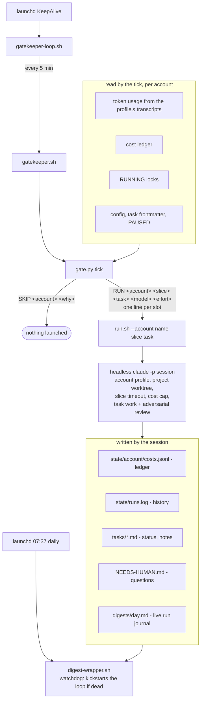

# Design notes

The engine's design, the reasoning behind each rule, and the failure modes that shaped it.
The [README](../README.md) is the short version; this file is the long one, including the full install steps.
It started life as the README itself and keeps the detail that made that README too long to land its point.

The engine has run the author's own backlog nightly since August 2026.
First month: 172 commits from background sessions, 44 task specs, 15 tasks completed fully autonomously (spec to verified done), 16 morning digests.
The failure modes were all infrastructure (launchd pended spawns, clamshell sleep, mtime-based idle detection), not model quality; each fix is documented where it lives.

## How it works



One constraint drives the whole design: background work shares a quota with a human who must never notice it.

Prior art: this is the [Ralph Wiggum loop](https://ghuntley.com/ralph/) (Geoffrey Huntley) with a budget and a verifier - same "one task per fresh-context session against a backlog" core, plus quota-aware scheduling and mandatory verification, which addresses the completion-without-testing failure mode Anthropic documents in [Effective harnesses for long-running agents](https://www.anthropic.com/engineering/effective-harnesses-for-long-running-agents).

- **Verification before landing.** Every task declares a `verification` method (tests, script, checkable criteria, optionally a per-item `## Acceptance` checklist), and each session must pass an adversarial review: a fresh-context subagent instructed to refute the work, looped until a pass finds zero new major issues.
- **Quota-aware scheduling.** A decaying reserve protects a P90 heavy day for every remaining day of the quota week; background sessions consume only the surplus, mostly at night (02:00-06:00).
- **Activity lock.** Idle time comes from interactive event timestamps in session transcripts; any recent human activity on an account blocks its night launches. The pre-reset burn-down ignores it: the surplus expires at the reset, and a clash with the owner's own use costs less than a skipped tick.
- **Prerequisite gating.** `prerequisites: <task> <task>` in a task's frontmatter keeps it unscheduled until every named task is `done`.
- **Deferred resume.** `not_before: YYYY-MM-DDTHH:MM` (local time; a date alone means midnight) keeps a `ready` task unscheduled until that time, so a session whose next step must wait hands the task back without being relaunched into a no-op slice. An unparseable value is reported as misconfigured, never guessed.
- **Done tasks archive themselves.** Sessions and the owner only ever set `status: done`; the gatekeeper moves such a task to `tasks/archive/` on its next tick once the file has been left alone for the lock TTL (no session can still be writing it), so `tasks/` only lists live work. The scheduler and sessions glob `tasks/*.md` only; a lookup by name (a prerequisite, a manual launch) also resolves `tasks/archive/<name>.md`, and a file there is `done` by definition. To reopen a task, set it `ready` first, then move it back to `tasks/` (in the other order a tick can re-archive it in between, since a move keeps the old mtime); a live file always wins over its archived copy, and an archived file that is not `done` is reported as unschedulable.
- **Interactive tasks.** `mode: interactive` marks a task that needs the owner in a live session (review, arbitration, a decision); the default is `mode: autonomous`.
  The engine never launches an interactive task, not even by name through `manual.py`, but it stays `ready` so `gate.py status` lists it (`interactive task=...`) and the digest puts it at the top of the owner's day.
  Interactive tasks due within a day, or overdue, are listed first, earliest deadline first (`due=` on the line); the rest follow by priority.
  Any other `mode:` value makes the task unschedulable and reported.
- **Declared delivery.** Every task states `delivery: branch|pr|local` and the session must honor it: `pr` means the task is not done until the branch is pushed and the PR is open with its URL recorded, `branch` means a local commit and no push, `local` means nothing leaves the machine. Leaving it to the session's judgement produced a night where four of five finished tasks sat in unpushed worktrees and one opened a PR, with nothing in the tasks distinguishing them.
- **Rails as deny rules.** The delivery rails are enforced by the harness, not by the prompt: `orchestrator/lib/permissions.py` builds each session's `--disallowedTools` list, denying pushes and mutating `gh` calls to every session that is not `pr`, and force pushes, `git filter-branch` and credential reads to every session. A deny rule is a glob over the command string, so each family enumerates its spellings (`rtk` prefix, `git -C`, trailing flags); `git reset --hard` stays allowed on purpose, since it only discards work in a disposable worktree.
- **Kill switch.** `touch orchestrator/PAUSED` under the backlog root stops all launches; deleting it resumes.
- **No silent defaults.** A frontmatter value the engine interprets gets a default when the key is ABSENT, never when it is present and unreadable: an unknown `model:` or `project:`, or a missing `delivery:`, makes the task unschedulable and reported (`gate.py status`, every tick's log), because work done at the wrong model or in the wrong place costs more than work not done.
- **Self-repair.** A session killed mid-task leaves it `in-progress`, which no scheduler ever picks again; the gatekeeper resets such a task to `ready` once no live session can account for it, keeping its last notes so the next session resumes rather than restarts.
- **One worktree per task.** A session never works in a repo's main checkout, where the owner and other concurrent sessions keep their uncommitted work: before launching, `run.sh` asks `orchestrator/lib/workspace.py` for the session's directories, and every project dir that is a git repo comes back as `<repo>/.agent-worktrees/<task>` on branch `agent/<task>`, created from the remote's default branch or reused by the next slice (a task whose work predates this names its branch with `branch:`, and that branch's worktree is reused). Only that worktree is passed as `--add-dir`, and a session that cannot get its worktree is not launched. A task that must work in the main checkout declares `workdir: main` (any other value makes it unschedulable), and so does a project whose repo is a notes store rather than code (project key `workdir: main`).
A repo only some tasks touch goes in the project's `optional_dirs` instead of `dirs`: a task that declares it by basename in `uses: [name]` gets a worktree of it like any other dir, and every other session gets its main checkout read-only, enforced by `Edit`/`Write`/`NotebookEdit` denies on the path plus best-effort Bash denies (mutating `git -C <path>`, redirections, common writers), so no task pays for a worktree it never uses.
Sessions start in a directory outside every repo (`~/.local/state/claudemaxxing/session`), so a git command that forgot its `-C` fails instead of switching a checkout. Once a task's branch is merged into `origin/main` or its PR is merged or closed, the night janitor removes its worktree, if it is clean; a dirty one is kept, logged, and listed by `gate.py status` (`dirty_worktree`) until the next sweep, so the digest puts it in Questions.
- **Stack janitor.** Sessions leave docker compose stacks running in their worktrees, and a stale stack holding a host port makes the next session's verification fail; at night, with no session running and the owner away, the gatekeeper runs `docker compose down` (volumes kept) on every stack whose working directory is under a project's `.agent-worktrees/`, and never touches anything else.
- **Live morning digest.** Every run journals its progress into the day's digest file as it finishes; the 07:37 session curates it into "done autonomously" vs "needs the human". Readable at any hour.

## Accounts and projects

An **account** is one Claude subscription: its own profile dir, quota calibration, budget, activity lock, and cost ledger.
A **project** routes tasks to an account and declares which directories its sessions may write.
The tool imposes no taxonomy; task frontmatter picks a project with `project: <name>`.

The motivating example: work tasks run on an employer-provided subscription, personal tasks on your own.
Neither budget, idle clock, nor ledger ever crosses over, so your employer's quota never subsidizes your hobby projects (or the reverse).
A legacy flat config with no `accounts`/`projects` sections still works: a `default` account and project are synthesized.

## Install

Requirements: **macOS only** (the shipped scheduling adapter is launchd + pmset; the seam for other OSes is documented in `orchestrator/platform/README.md`), Python 3.9+, the Claude Code CLI.
Nothing to install on the Python side: standard library only, no virtualenv, no pip.

1. Clone the repo; its root is the backlog root (`tasks/`, `digests/`, `NEEDS-HUMAN.md` live there, gitignored).
2. Declare your `accounts` and `projects` in `orchestrator/config.yaml` (fully documented example in the file).
3. Let each account calibrate its own caps: pipe the status line's stdin to the recorder from the status line script of that account's profile (`statusLine` in `<claude_config_dir>/settings.json`), and seed the history once.
   See "Caps from rate-limit readings" below for the snippet and the seed command.
4. Create a task in `tasks/` (see `examples/tasks/`) with `status: ready` and a matching `project:`.
5. Run `orchestrator/install.sh`; it registers the gatekeeper loop and the daily digest job, and prints the one manual `pmset` step for nightly wake.
6. Optional: a fine-grained PAT in `~/.config/backlog-agents/github-token` enables background git pushes.
7. Optional: `brew install terminal-notifier` makes the "backlog needs you" notifications clickable, opening `NEEDS-HUMAN.md` with `notify_open_cmd`.
   macOS attributes `osascript` notifications to Script Editor and gives them no click action, so without it the alert still shows but leads nowhere.
   terminal-notifier needs its own switch in System Settings > Notifications; when it is refused the adapter silently falls back to `osascript`.

Manual runs, at any hour, whenever the owner decides: `orchestrator/manual.sh --for 5h`, `--count <N>` or `--tasks <a> <b> ...` (add `--dry-run` to see the plan first, `--stop` to stop launching).
They skip every pacing rule (night window, morning guard, budget share, activity lock) and keep the safety ones (parallel and Fable slots, per-session cost cap, locks, refused models, prerequisites, kill switch); see `orchestrator/manual.py`.
The runner detaches and keeps the machine awake on battery too; only a closed lid still sleeps.
A single session: `orchestrator/run.sh <minutes> [--account <name>]`.
Dry run: `dry_run: true` in the config, then watch `state/gatekeeper.log` for a night.
Rehearse a whole night in seconds, in a throwaway backlog with a stubbed `claude` and zero tokens: `orchestrator/e2e-sandbox.sh`.

Install against your backlog with `BACKLOG_ROOT=~/backlog orchestrator/install.sh` and put your real config at `$BACKLOG_ROOT/config.yaml`; it lives outside this repo and is never committed.
The install records that root in `~/.config/claudemaxxing/backlog-root`, so an interactive shell (`gate.py status`, `manual.sh`) resolves the same backlog as the scheduled jobs without exporting anything.
The root resolves from `ORCH_ROOT`, then `BACKLOG_ROOT`, then that file; with none of them every entry point exits with an error instead of silently reading the repo's example data, which only `ORCH_EXAMPLE=1` selects (tests, experiments).
Human-facing output (`gate.py status`, manual dry runs and starts) prints `backlog=<path>` on its first line.

Note: a closed MacBook lid cannot stay awake for the night regime (clamshell sleep has no software override); lid open on AC power plus `sudo pmset -c sleep 0` is the working setup.

## Checks

`./check.sh` runs every gate: the config and settings files parse, `ruff check`, `shellcheck` on every `*.sh`, and the unit tests.
CI runs exactly this script on every pull request and on `main` (`.github/workflows/ci.yml`), so a local pass means a CI pass.
It needs `python3`; `ruff` and `shellcheck` come from your PATH, else are fetched with `uvx`.
A change is done only once CI is green on its pull request.

## Design details

**Scheduling regimes, per account.**
Night: as many slots as tonight's token allocation pays for (up to the `max_parallel_sessions` safety ceiling), every model reachable, guarded so no 5h quota window crosses the morning guard into the workday.
The usable night is `night_start` .. `morning_guard - 5h`, not `night_start` .. `night_end`: a launch opens a 5h quota window that runs in wall-clock time however short the session is, so past that hour there is nothing a shorter slice can buy.
A window may end up to `guard_tolerance_min` (15) past the guard: on 2026-09-27 a follow-on window ending two minutes past it chopped the rest of the night into 33/23/18/13/7-minute slices, and the owner sharing a few morning minutes costs far less than a night of cold starts.
Near the end of a window a slice is clamped to what is left, but never launched below `min_slice_min` (20): every session pays a fixed cold start, so the tick skips with an "end of window" reason instead.
A queue task whose last session tonight left most of a longer slice unused is not relaunched into a shorter one, and the storm detector does not count such clamped relaunches against the task.
Each session's prompt carries its absolute start and deadline, since a headless session has no clock; one that exits with more than half its slice unused while its task has work left is tagged `early_exit` in runs.log and the digest.
The model a session runs is the one its task declares, always: nothing caps it, nothing upgrades it, and the engine holds no ordering between the models at all - the scheduler reads a task's model only to estimate what its session will cost.
The budget is the single gate on what a night may spend, so a `fable` task competes on priority like any other and a night normally mixes models; `max_fable_slots` paces the one model with a separate limit of its own.
Pre-reset burn-down: the last hours before the weekly reset run without a budget at all, because quota left unspent at the reset is simply lost. A dying surplus buys more sessions, not dearer ones.
The measured consumption is an estimate; obeying it is worth it during the week, where it only paces spending, and not on the last night, where its error is the only thing that can strand the surplus.
The account's real limit is observed there rather than predicted: a session that hits the wall records it and later ticks stop launching that model, and a task cut mid-slice resumes at the start of the next week.
Daytime: nothing, ever. The workday belongs to the owner; a daytime run is a deliberate `manual.sh` or `run.sh` invocation.

**Budget controller.**
The unit is USD at Anthropic list price, computed locally from the transcripts with a per-family price table (`lib/transcripts.py`), because the account's limit weighs tokens by price: on 2026-09-12, 14M local tokens of Fable and Opus moved the weekly `/usage` bar 4 points while 22M tokens of Sonnet moved it 1, the ratio of their list prices.
It is not what the subscription bills; it is the weighting the limit applies, and the same unit Claude Code reports per session (`total_cost_usd`).
The token-era keys (`weekly_cap_tokens`, `window_cap_tokens`, `p90_daily_tokens`, `est_session_tokens`, `*_min_surplus_tokens`) are retired: an account still carrying one is reported as misconfigured and not scheduled, never converted, since no factor turns a model-blind token count into dollars.
**Caps from rate-limit readings.**
The caps are not configured, they are derived (`orchestrator/lib/ratelimits.py`).
Claude Code hands the status line command `rate_limits.five_hour` and `rate_limits.seven_day` (`used_percentage`, `resets_at`) on Pro and Max accounts, the same data as `/usage`.
The recorder appends each reading to `state/<account>/rate_limits.jsonl` with the engine's own USD over the reading's period, at most one row a minute and only when a value changed, and `cap = engine_usd / (used_percentage / 100)`.
Only readings at 10% of the week or 20% of the window and above count (they bound the whole-percent rounding error to 5%), a day's usable readings reduce to their median, and a day median more than 15% away from the cap in use is a limit change that replaces it outright; `p90_daily_usd` scales with the weekly cap.
At night no reading arrives, so the engine carries the latest derived caps forward; `gate.py status` prints each cap with its source (`reading`, `history`, `seed`) and age, and the digest relays it.
Hook it from the account's status line script with `BACKLOG_ROOT` set (a status line does not inherit the launchd environment), detached so the transcript scan (about a second) never delays the status line:

```python
import os, subprocess, sys
rec = subprocess.Popen([sys.executable, "<engine>/orchestrator/lib/ratelimits.py", "record", "<account>"],
                       env=dict(os.environ, BACKLOG_ROOT="<backlog root>"),
                       stdin=subprocess.PIPE, stdout=subprocess.DEVNULL, stderr=subprocess.DEVNULL,
                       start_new_session=True)
try:
    rec.stdin.write(raw_stdin_bytes); rec.stdin.close()
except OSError:
    pass  # a recording failure never breaks the status line
```

Seed the history once with a hand reading (weekly, window, p90 daily, when), then let the first usable reading supersede it: `python3 orchestrator/lib/ratelimits.py seed <account> 850 58 114 2026-09-24T23:10:00+02:00`.
Until a seed exists the account is reported `uncalibrated` and not scheduled.
Usage from other devices or claude.ai is invisible to the engine and skews the ratio, and the per-model (Fable) weekly bar is not in the data: the wall is still observed, not predicted (below).
The keys `weekly_cap_usd`, `window_cap_usd`, `p90_daily_usd`, `promo_multiplier` and `promo_until` are retired: an account still carrying one is reported as misconfigured.

`available = weekly_cap - consumed - p90_daily_reserve * days_remaining`; the reserve decays linearly to zero at reset, so the week starts protective and ends fully released.
Slot counts are budget-driven: a session's estimated burn must fit the slice budget, so a night is one heavy session or many small ones depending on the work, never a fixed task count.
The per-model rules (`max_fable_slots`, a model observed out of quota) are applied inside the selection, while the queue is being cut to the free slot count, not to its output afterwards: a queue head heavy in one model would otherwise leave slots empty that the rest of the queue could fill.
Consumption is measured by reading Claude Code's own transcript files (`lib/transcripts.py`), de-duplicated per billed message, with the real 5h window start (the first token, not the top of that hour).

**Quota exhaustion is observed, not predicted.**
The budget paces the week; it does not tell you when a model is about to be refused, because the price weighting is calibrated against `/usage` from a handful of readings on one night (`specs/2026-09-12-usd-budget.md` in the backlog root), which is enough to pace spending and too coarse to call the wall.
The bars are server-side truth and include usage the transcripts cannot see (other devices, claude.ai).
So the wall is learned by hitting it: a session that dies on `You've hit your <scope> limit - resets <time>` has that fact recorded per model family in `state/<account>/exhausted.json`, and later ticks stop offering that model until the stated reset.
It is per model on purpose - the night this was built, Fable was refused at 02:25 while Sonnet kept working in the same window - and any other failure records nothing, so an ordinary crash never costs a model its eligibility.
`max_fable_slots` caps how many Fable sessions may run concurrently (1 by default; `prereset_max_fable_slots` and `prereset_max_parallel_sessions` override the two ceilings in the burn-down): its binding constraint is a token limit rather than wall-clock time, so parallel Fable sessions only race each other to that wall while starving the cheaper models of slots.
It counts the sessions still RUNNING, not just the tick's own launches: `run.sh` writes the model into the `RUNNING.N` lock, and the tick reads it back, because a session outlives the tick that launched it by many ticks.

**Per-night allocation.**
A night spends its own share of the weekly surplus, not the whole of it, or the first night of the week drains the ones that follow.
The share is back-loaded: with `night_budget_ratio` r, the j-th of the n remaining nights gets weight r^(j-1), the last night before the reset is open bar, and quota the remaining nights could not physically absorb is burned tonight rather than stranded.
A night absorbs one 5h quota window, except the last one: it is the pre-reset burn-down, bounded by neither night_end nor the morning guard, so it spans `ceil(prereset_burn_hours / 5)` windows and the plan may hoard that much for it.
It adapts without any memory: `available` is recomputed from measured usage on every tick, so a heavy interactive day shrinks every later night and a quiet one grows it.

**Queue order.**
The queue follows Kanban classes of service, lexicographic inside each class.
Tasks of a project declaring `class: expedite` go first, whatever their priority.
Then come dated tasks (`due: YYYY-MM-DD`, the fixed-date class) whose deadline is near, earliest deadline first.
Then everything else, by the task's own priority, with the project's `rank` only breaking ties, then age.
So a `high` task of the lowest-ranked project passes a `medium` one of the best-ranked: the project used to be the first sort key, and one busy project starved all the others.
A weighted score (priority weight times project weight, as in WSJF) was rejected for the same reason: a heavy enough project weight overrides task priority.
Priority and deadlines both propagate through `prerequisites`: a blocker inherits the best priority and the earliest deadline of the unfinished tasks waiting on it.
A dated task is "near" when the nights left are fewer than its chain needs (itself, then each dependent down to the dated one) plus one of margin, which is backward scheduling from the deadline.
`gate.py status` reports a past deadline as `overdue`, and a chain that can no longer fit or waits on a `blocked` task as `at_risk` with the date by which the owner must act; the digest relays both.

**Recurring work.**
Two scheduling classes sit outside the priority queue.
A task with `duty: nightly|weekly` is mandatory: it is taken off the top once per period, charged to the budget but never gated by it, so the queue cannot starve it.
A task with `filler: true` is the opposite: pure surplus, launched only once the queue is exhausted and only on budget that is already there.
Both stay `ready` forever; `state/<account>/duties.json` records the period each duty last ran, and periods are consumed at launch, so a failing duty does not relaunch every tick.
Whatever needs no reasoning (commit and push a directory, prune caches) belongs in a plain cron/launchd job instead - it should not burn tokens at all.

**The ledger is the memory.**
Every session's result JSON is appended to `state/<account>/costs.jsonl`; the measured cost per (task, model) feeds the next scheduling decision, and the digest surfaces per-task cost so the owner can kill money pits.
The tick that prints `RUN` for a queue task also claims it - `status: in-progress` plus a dated note - because a session takes minutes to record that itself, and the next tick used to launch a second session onto the still-`ready` task; duties, fillers and `parallel: true` shards are not claimed, they stay `ready` by contract, and a claim no session picks up is undone by the same self-repair that resets any stale `in-progress`.
Cost is learned per SESSION, not per minute: sessions use a median 3% of their slice, so slice length predicts nothing and the cold-start default (`est_session_usd`) is in the same unit as the learned figure.
The learned figure is the MAX of the last runs per (task, model), not their mean: on 2026-09-12 the actual/estimate ratio ranged from 0.1 to 15, because the mean of a cheap survey slice and an expensive implementation slice keeps quoting the survey, and an under-estimate launches sessions the night cannot pay for while an over-estimate only costs one session until the next tick re-measures.
The actual cost is Claude Code's own `total_cost_usd`, which includes the subagents a session spawned (pricing the top-level `usage` block alone came out 1.1x to 2.9x under it).
The caps are learned too, from the status line's rate-limit readings (see "Caps from rate-limit readings" above), so no limit change or promotion needs a human to re-read `/usage`.
The ledger lives at exactly one path per account, `state/<account>/costs.jsonl`: there is no top-level ledger, so a reader must never glob for one.
Every row carries the required keys (`ts`, `account`, `mode`, `task`, `model`, `effort`, `slice_min`, `exit`, `est_usd`); cost fields are optional and readers key off presence, with no backfill.
A row whose result file could not be parsed also carries `parse_error`, a `reason` and the raw `exit` status, and `gate.py status` prints a `ledger_coverage` line with the share of recent rows that carry no cost.

## FAQ

**Does it run on Linux or Windows?**
Not yet, but the engine is portable: everything OS-specific sits behind the seam in `orchestrator/platform/` (five hooks, documented in its README).
A Linux port would swap launchd for systemd timers in `platform/linux/`.

**Why does a tick not wait for the sessions it launched?**
It used to, and that turned the night into a batch: four slots launched at 02:00, one session running 20 minutes, and the loop slept until 02:50 with three slots idle.
Returning immediately makes it a pipeline - the next tick refills whatever came free.
This is why launchd's job is `gatekeeper-loop.sh` and not `gatekeeper.sh`: the loop never exits, so the sessions it spawned keep their process group.

**Why a KeepAlive loop instead of launchd StartInterval?**
This launchd domain left scheduled spawns pending across DarkWake cycles ("pended nondemand spawn"), losing whole nights.
A KeepAlive loop ticks itself; launchd only has to restart it if it dies, and the daily digest job doubles as a watchdog that kickstarts it.

**Why hard budget caps per session?**
`--max-budget-usd` is runaway protection, not pacing: a budget kill is a hard stop with no resume point.
The cap sits ~5x the observed max per-run cost, so it only fires on a genuinely broken session.

**Why does the gatekeeper pick tasks, not the session?**
The model must be known before launch (`claude -p --model ...`), and selection in pure Python costs zero tokens.
Everything decidable locally is decided locally.

**Why derive idle time from transcript events instead of file mtimes?**
Two independent writers bump transcript mtimes with no human present (external tools rewriting session files, Claude Code appending housekeeping events).
Only `user`/`assistant` event timestamps count; anything else starves the night regime.
